# Claude Code for data engineering

<small>April 21, 2026 · Data Engineering, AI Tooling, Productivity</small>

I spend the whole day on pipelines, transformations and infrastructure, and Claude Code has become a fixed part of that flow. It does not write the pipeline for me, but it clears the boilerplate out of the way and lets me focus on the decisions that matter. Here is how I use it day to day.

## Why it works for data

Data engineering is polyglot: SQL, Python, YAML, Terraform, Airflow, all in the same project. Claude Code's strength is understanding the context across those files, so it keeps a DAG, the transformation it triggers and the target table schema consistent with each other, instead of treating each file in isolation.

## In practice

```mermaid
%%{init: {'theme':'base', 'themeVariables': { 'primaryColor':'#191726','primaryTextColor':'#f8eaf8','primaryBorderColor':'#7386d0','lineColor':'#7386d0','secondaryColor':'#272d44','secondaryTextColor':'#f8eaf8','secondaryBorderColor':'#5dabf3','tertiaryColor':'#3c466f','tertiaryTextColor':'#f8eaf8','tertiaryBorderColor':'#79c0ff','background':'transparent','mainBkg':'#191726','textColor':'#f8eaf8','fontSize':'14px','fontFamily':'Mulish, system-ui, sans-serif'}}}%%
graph LR
    A[Requirements] --> B[Claude Code]
    B --> C[Generate code]
    C --> D[Review and test]
    D --> E{Approved?}
    E -->|No| F[Iterate with Claude]
    F --> B
    E -->|Yes| G[Deploy]
    G --> H[Monitor]
    H --> I{Issues?}
    I -->|Yes| J[Debug with Claude]
    J --> B
    I -->|No| K[Production]

    style B fill:#272d44,stroke:#7386d0,stroke-width:3px
    style K fill:#3c466f,stroke:#5dabf3,stroke-width:2px
```

The uses that save me the most time:

- **ETL pipelines**: I describe source, transformation and target, and it builds the connectors with error handling, validation and idempotent loads.
- **Slow SQL queries**: I share the SQL and the schemas, and it points out indexes, rewrites and partitioning strategies.
- **Data quality**: it generates Great Expectations suites from profiling output, plus validation functions for business rules.
- **Airflow DAGs**: it scaffolds the structure with dependencies, retries and alerts, cutting the boilerplate.
- **Schema evolution**: it writes the `ALTER TABLE` statements and adjusts downstream dependencies in a backward-compatible way.

## How I get more out of it

What makes the difference is not the perfect prompt, it is the context. In practice:

- **I give context before asking**: schemas, existing code for it to mirror the pattern, and the project's config files.
- **I keep a `CLAUDE.md`** with naming conventions, preferred libraries and deploy procedures. It reads it and follows it.
- **I am specific**: "process 10M rows a day with under 5 minutes of latency" gets far better results than "fast pipeline".
- **I iterate in stages**: high-level logic first, then edge cases, then tests.

## Where to be careful

It speeds things up, but it does not replace review. The points I always check:

| Area             | Risk                          | How I mitigate it                         |
| ---------------- | ----------------------------- | ----------------------------------------- |
| **SQL logic**    | Wrong joins or aggregations   | Test against samples of real data         |
| **Security**     | Over-permissive IAM           | Review every permission grant             |
| **Performance**  | Inefficient at scale          | Benchmark with production volumes         |
| **Idempotency**  | Duplicate data                | Verify behavior on re-runs                |
| **Compliance**   | PII exposure                  | Audit how the data is handled             |

## Conclusion

Claude Code does not replace technical knowledge; it amplifies productivity by handling the boilerplate and keeping a large project consistent. The best way to think of it is as an experienced pair: with context and iteration, it becomes an indispensable tool for building reliable data platforms.

---

_Have you used Claude Code for data engineering? Tell me how it went on [LinkedIn](https://www.linkedin.com/in/vinicius-amorim/)._
