# Todos os diagramas Mermaid no tema Moonlight

<small>4 de setembro de 2026 · Ferramentas, Documentação</small>

Esta página é uma galeria de referência: os 21 tipos de diagrama que o Mermaid 11 renderiza, alguns em mais de uma orientação, todos com o tema deste site. O tema é o [Moonlight](../projects.md#visual), a mesma paleta dos meus temas para VSCode e Oh My Posh, traduzida para o Mermaid em duas variantes, escura e clara. Troque o modo de cor no topo da página e os diagramas são renderizados de novo na hora.

O Mermaid expõe centenas de variáveis de tema, mas várias partes dos diagramas não obedecem a nenhuma delas: pontas de seta, relações de classe, rostos da jornada, linhas da linha do tempo, cores fixas do Sankey e do C4. O tema resolve isso em duas camadas: as variáveis, geradas a partir de uma paleta por modo de cor, e uma folha de CSS injetada no SVG para o que sobra. Cada seção abaixo diz o que observar.

Todo diagrama tem uma barra de ferramentas acima dele: alternar entre diagrama e código-fonte, copiar o código e expandir em tela cheia com pan e zoom (roda do mouse ou pinça para aproximar, arrastar para mover, duplo clique ou `0` para ajustar à tela, `+` e `-` para zoom, `Esc` para fechar).

## Fluxograma pequeno, da esquerda para a direita

Caso base do tema: nós com fundo do card, borda e setas na cor primária. Sub-rotinas (`[[X]]`) ganham borda amarela, a cor de destaque da paleta.

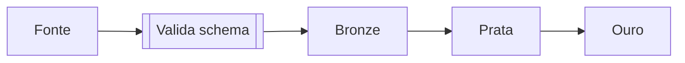
```mermaid
graph LR
    A[Fonte] --> V[[Valida schema]]
    V --> B[Bronze]
    B --> C[Prata]
    C --> D[Ouro]
```

## Fluxograma de cima para baixo, com decisão

Losangos e rótulos de aresta usam o mesmo fundo dos nós. As pontas das setas recebem a cor primária via CSS, porque a variável do Mermaid não as alcança.

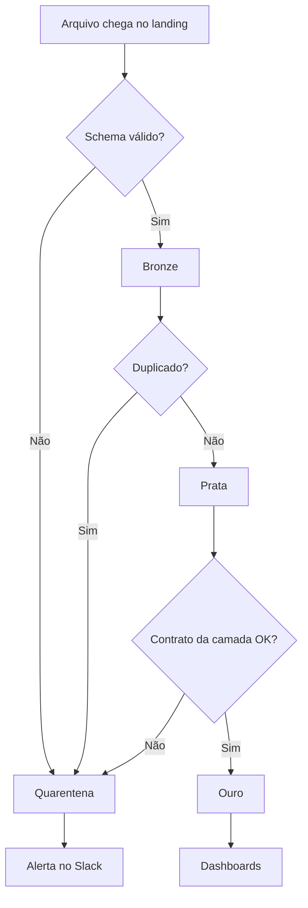
```mermaid
graph TD
    A[Arquivo chega no landing] --> B{Schema válido?}
    B -->|Sim| C[Bronze]
    B -->|Não| Q[Quarentena]
    C --> D{Duplicado?}
    D -->|Sim| Q
    D -->|Não| E[Prata]
    E --> F{Contrato da camada OK?}
    F -->|Sim| G[Ouro]
    F -->|Não| Q
    Q --> H[Alerta no Slack]
    G --> I[Dashboards]
```

## Fluxograma largo, com subgrafos

Bom para testar o ajuste horizontal: em telas menores ele encolhe até ficar ilegível, e o zoom resolve. Subgrafos usam o card interno com borda discreta, para agrupar sem competir com os nós.

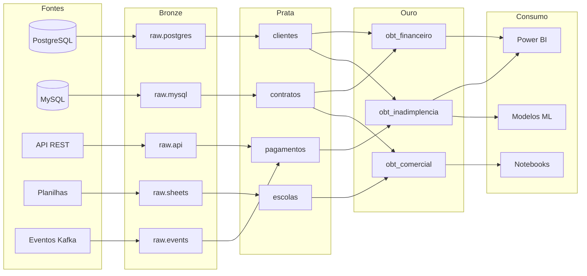
```mermaid
graph LR
    subgraph Fontes
        S1[(PostgreSQL)]
        S2[(MySQL)]
        S3[API REST]
        S4[Planilhas]
        S5[Eventos Kafka]
    end
    subgraph Bronze
        B1[raw.postgres]
        B2[raw.mysql]
        B3[raw.api]
        B4[raw.sheets]
        B5[raw.events]
    end
    subgraph Prata
        P1[clientes]
        P2[contratos]
        P3[pagamentos]
        P4[escolas]
    end
    subgraph Ouro
        O1[obt_financeiro]
        O2[obt_inadimplencia]
        O3[obt_comercial]
    end
    subgraph Consumo
        C1[Power BI]
        C2[Notebooks]
        C3[Modelos ML]
    end
    S1 --> B1 --> P1
    S2 --> B2 --> P2
    S3 --> B3 --> P3
    S4 --> B4 --> P4
    S5 --> B5 --> P3
    P1 --> O1
    P2 --> O1
    P3 --> O2
    P1 --> O2
    P4 --> O3
    P2 --> O3
    O1 --> C1
    O2 --> C1
    O2 --> C3
    O3 --> C2
```

## Fluxograma alto, de baixo para cima

Testa a rolagem vertical e o ajuste quando a altura é o limite.

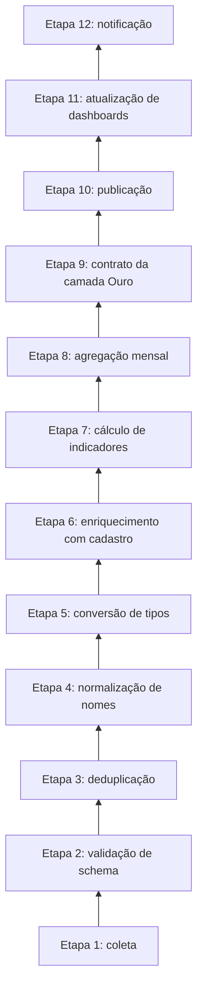
```mermaid
graph BT
    N1[Etapa 1: coleta] --> N2[Etapa 2: validação de schema]
    N2 --> N3[Etapa 3: deduplicação]
    N3 --> N4[Etapa 4: normalização de nomes]
    N4 --> N5[Etapa 5: conversão de tipos]
    N5 --> N6[Etapa 6: enriquecimento com cadastro]
    N6 --> N7[Etapa 7: cálculo de indicadores]
    N7 --> N8[Etapa 8: agregação mensal]
    N8 --> N9[Etapa 9: contrato da camada Ouro]
    N9 --> N10[Etapa 10: publicação]
    N10 --> N11[Etapa 11: atualização de dashboards]
    N11 --> N12[Etapa 12: notificação]
```

## Fluxograma da direita para a esquerda

Mesma paleta em qualquer direção; só o layout muda.

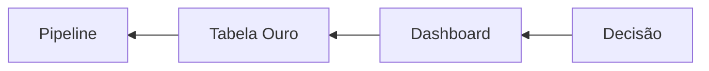
```mermaid
graph RL
    D[Decisão] --> C[Dashboard]
    C --> B[Tabela Ouro]
    B --> A[Pipeline]
```

## Diagrama de sequência

Atores no card, linhas de vida e mensagens na cor primária, notas no tom `deep`; ativações no tom `accent` com borda amarela.

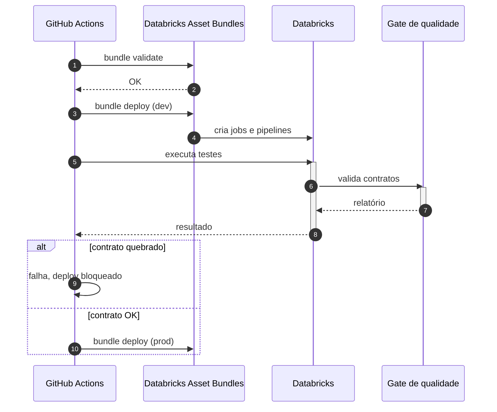
```mermaid
sequenceDiagram
    autonumber
    participant GH as GitHub Actions
    participant DAB as Databricks Asset Bundles
    participant DBX as Databricks
    participant DQ as Gate de qualidade
    GH->>DAB: bundle validate
    DAB-->>GH: OK
    GH->>DAB: bundle deploy (dev)
    DAB->>DBX: cria jobs e pipelines
    GH->>DBX: executa testes
    activate DBX
    DBX->>DQ: valida contratos
    activate DQ
    DQ-->>DBX: relatório
    deactivate DQ
    DBX-->>GH: resultado
    deactivate DBX
    alt contrato quebrado
        GH->>GH: falha, deploy bloqueado
    else contrato OK
        GH->>DAB: bundle deploy (prod)
    end
```

## Diagrama de classes

Relações e setas na cor primária, tracejadas para dependências e realizações.

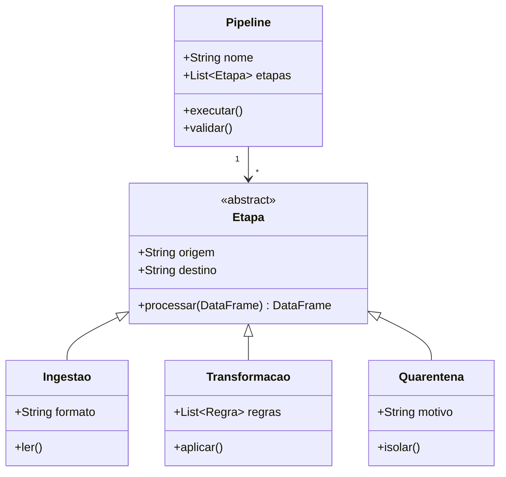
```mermaid
classDiagram
    class Pipeline {
        +String nome
        +List~Etapa~ etapas
        +executar()
        +validar()
    }
    class Etapa {
        <<abstract>>
        +String origem
        +String destino
        +processar(DataFrame) DataFrame
    }
    class Ingestao {
        +String formato
        +ler()
    }
    class Transformacao {
        +List~Regra~ regras
        +aplicar()
    }
    class Quarentena {
        +String motivo
        +isolar()
    }
    Pipeline "1" --> "*" Etapa
    Etapa <|-- Ingestao
    Etapa <|-- Transformacao
    Etapa <|-- Quarentena
```

## Diagrama de estados

Estados no card, transições na cor primária, estados compostos no card interno com título no tom `accent`.

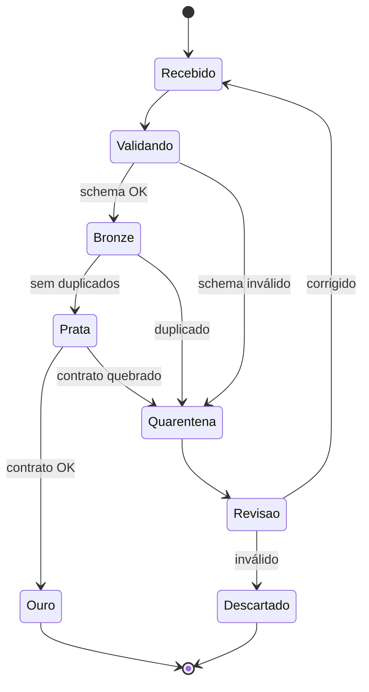
```mermaid
stateDiagram-v2
    [*] --> Recebido
    Recebido --> Validando
    Validando --> Bronze: schema OK
    Validando --> Quarentena: schema inválido
    Bronze --> Prata: sem duplicados
    Bronze --> Quarentena: duplicado
    Prata --> Ouro: contrato OK
    Prata --> Quarentena: contrato quebrado
    Quarentena --> Revisao
    Revisao --> Recebido: corrigido
    Revisao --> Descartado: inválido
    Ouro --> [*]
    Descartado --> [*]
```

## Modelo entidade-relacionamento

Atributos alternam card e card interno, linha a linha; relacionamentos na cor primária.

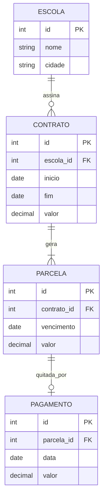
```mermaid
erDiagram
    ESCOLA ||--o{ CONTRATO : assina
    CONTRATO ||--|{ PARCELA : gera
    PARCELA ||--o| PAGAMENTO : quitada_por
    ESCOLA {
        int id PK
        string nome
        string cidade
    }
    CONTRATO {
        int id PK
        int escola_id FK
        date inicio
        date fim
        decimal valor
    }
    PARCELA {
        int id PK
        int contrato_id FK
        date vencimento
        decimal valor
    }
    PAGAMENTO {
        int id PK
        int parcela_id FK
        date data
        decimal valor
    }
```

## Gantt

Tarefas no tom `deep`, ativas na cor primária, concluídas no tom `accent`, críticas em vermelho. A linha de hoje é o amarelo Moonlight.

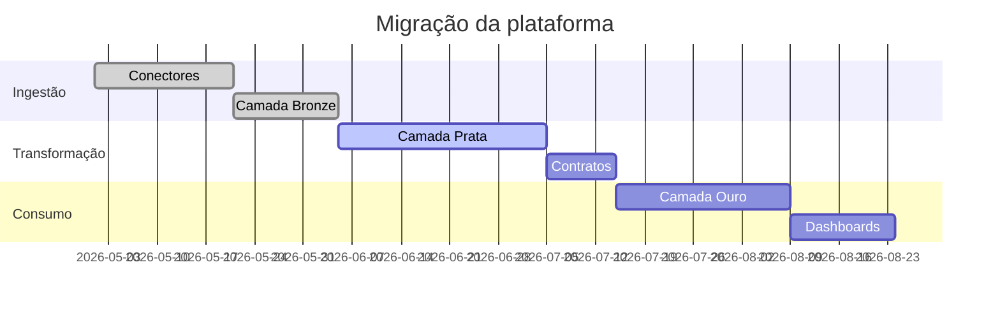
```mermaid
gantt
    title Migração da plataforma
    dateFormat YYYY-MM-DD
    section Ingestão
        Conectores        :done, a1, 2026-05-01, 20d
        Camada Bronze     :done, a2, after a1, 15d
    section Transformação
        Camada Prata      :active, b1, 2026-06-05, 30d
        Contratos         :b2, after b1, 10d
    section Consumo
        Camada Ouro       :c1, after b2, 25d
        Dashboards        :c2, after c1, 15d
```

## Pizza

Fatias nos tons `tinted`: cada matiz da série misturado ao fundo do card, para o gráfico não gritar.

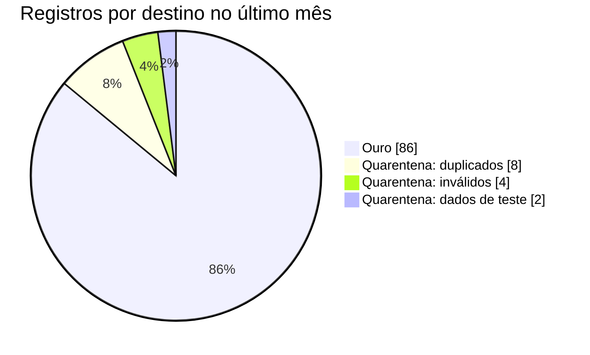
```mermaid
pie showData
    title Registros por destino no último mês
    "Ouro" : 86
    "Quarentena: duplicados" : 8
    "Quarentena: inválidos" : 4
    "Quarentena: dados de teste" : 2
```

## Grafo de git

Branches nos tons `mid`, mais fortes que a pizza, com texto escuro sobre eles; tags em amarelo.

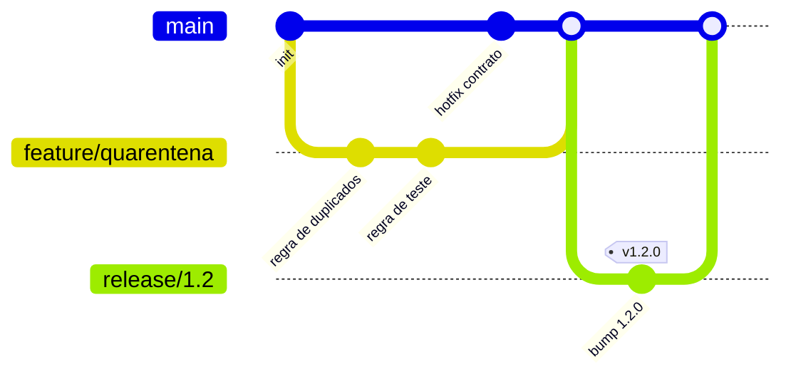
```mermaid
gitGraph
    commit id: "init"
    branch feature/quarentena
    checkout feature/quarentena
    commit id: "regra de duplicados"
    commit id: "regra de teste"
    checkout main
    commit id: "hotfix contrato"
    merge feature/quarentena
    branch release/1.2
    checkout release/1.2
    commit id: "bump 1.2.0" tag: "v1.2.0"
    checkout main
    merge release/1.2
```

## Jornada do usuário

Etapas nos tons `mid`; rostos em amarelo, com olhos e boca na cor do fundo.

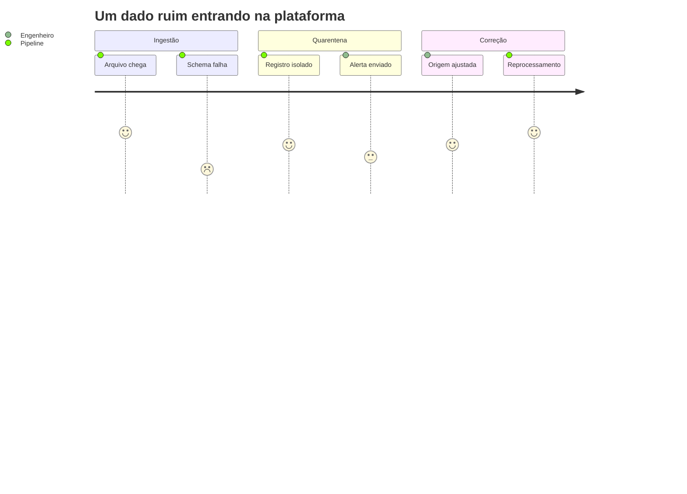
```mermaid
journey
    title Um dado ruim entrando na plataforma
    section Ingestão
        Arquivo chega: 5: Pipeline
        Schema falha: 2: Pipeline
    section Quarentena
        Registro isolado: 4: Pipeline
        Alerta enviado: 3: Engenheiro
    section Correção
        Origem ajustada: 4: Engenheiro
        Reprocessamento: 5: Pipeline
```

## Mapa mental

Ramos nos tons `tinted`, um por nível; a raiz com borda na cor primária.

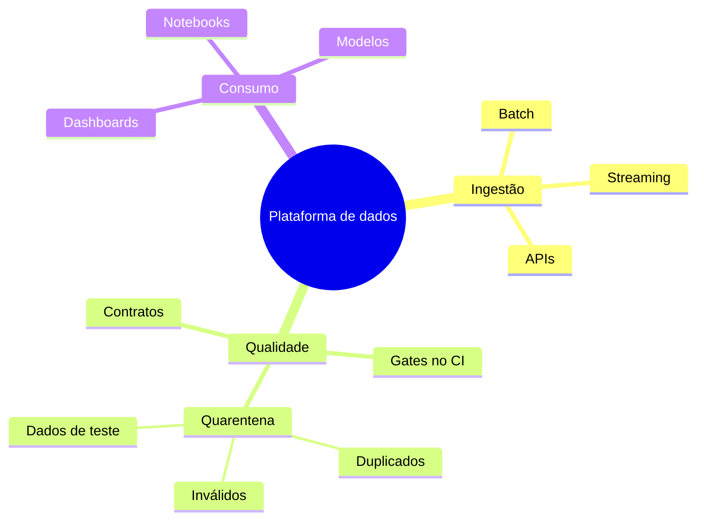
```mermaid
mindmap
  root((Plataforma de dados))
    Ingestão
      Batch
      Streaming
      APIs
    Qualidade
      Contratos
      Quarentena
        Duplicados
        Inválidos
        Dados de teste
      Gates no CI
    Consumo
      Dashboards
      Notebooks
      Modelos
```

## Linha do tempo

Eventos nos tons `tinted`. Linha e marcadores forçados para a cor primária, já que o Mermaid os desenha em preto.

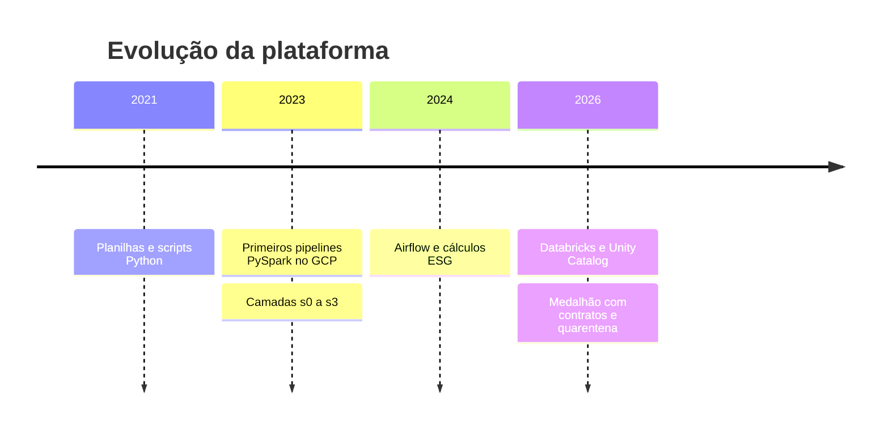
```mermaid
timeline
    title Evolução da plataforma
    2021 : Planilhas e scripts Python
    2023 : Primeiros pipelines PySpark no GCP
         : Camadas s0 a s3
    2024 : Airflow e cálculos ESG
    2026 : Databricks e Unity Catalog
         : Medalhão com contratos e quarentena
```

## Quadrantes

Quadrantes alternam card e card interno; pontos em amarelo para saltar do fundo.

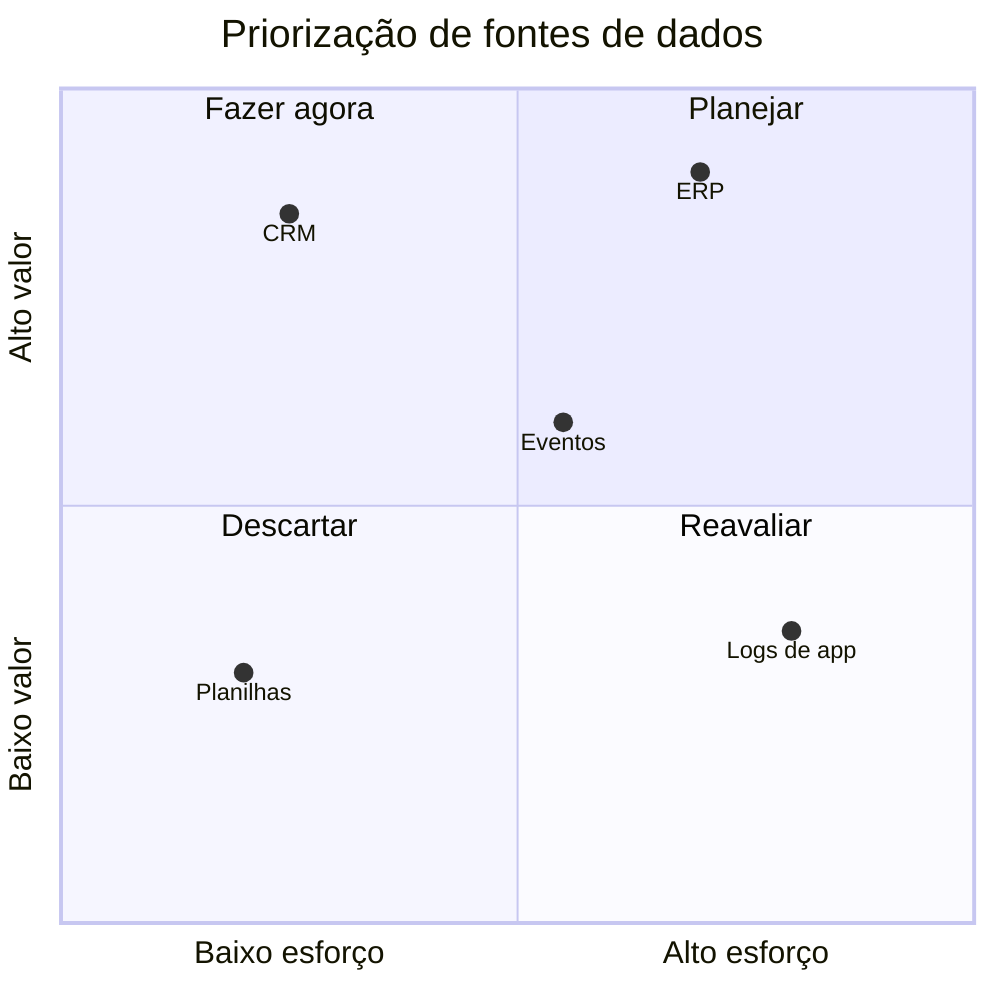
```mermaid
quadrantChart
    title Priorização de fontes de dados
    x-axis Baixo esforço --> Alto esforço
    y-axis Baixo valor --> Alto valor
    quadrant-1 Planejar
    quadrant-2 Fazer agora
    quadrant-3 Descartar
    quadrant-4 Reavaliar
    CRM: [0.25, 0.85]
    ERP: [0.7, 0.9]
    Planilhas: [0.2, 0.3]
    Logs de app: [0.8, 0.35]
    Eventos: [0.55, 0.6]
```

## Requisitos

Requisitos e elementos no card com borda primária; relações na cor primária, rótulos sobre o fundo da página.

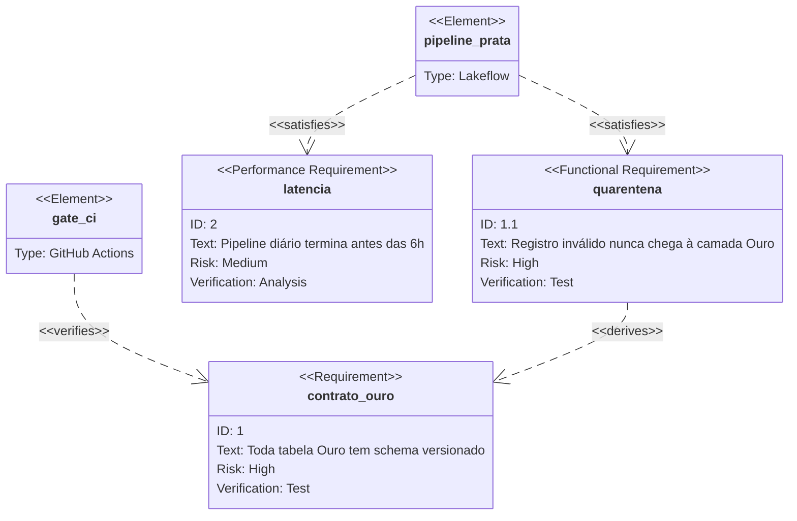
```mermaid
requirementDiagram
    requirement contrato_ouro {
        id: 1
        text: Toda tabela Ouro tem schema versionado
        risk: high
        verifymethod: test
    }
    functionalRequirement quarentena {
        id: 1.1
        text: Registro inválido nunca chega à camada Ouro
        risk: high
        verifymethod: test
    }
    performanceRequirement latencia {
        id: 2
        text: Pipeline diário termina antes das 6h
        risk: medium
        verifymethod: analysis
    }
    element gate_ci {
        type: GitHub Actions
    }
    element pipeline_prata {
        type: Lakeflow
    }
    gate_ci - verifies -> contrato_ouro
    pipeline_prata - satisfies -> quarentena
    quarentena - derives -> contrato_ouro
    pipeline_prata - satisfies -> latencia
```

## Contexto C4

Pessoas na cor primária, sistemas no tom `deep`, externos no tom `accent`. O Mermaid força texto branco nos elementos C4; o tema corrige depois da renderização.

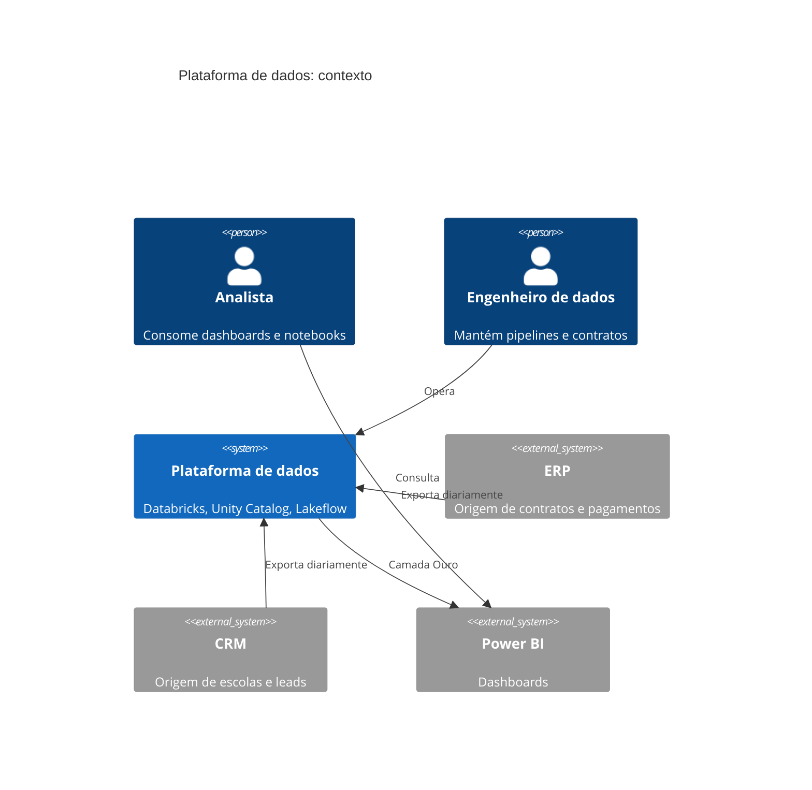
```mermaid
C4Context
    title Plataforma de dados: contexto
    Person(analista, "Analista", "Consome dashboards e notebooks")
    Person(eng, "Engenheiro de dados", "Mantém pipelines e contratos")
    System(plataforma, "Plataforma de dados", "Databricks, Unity Catalog, Lakeflow")
    System_Ext(erp, "ERP", "Origem de contratos e pagamentos")
    System_Ext(crm, "CRM", "Origem de escolas e leads")
    System_Ext(bi, "Power BI", "Dashboards")
    Rel(erp, plataforma, "Exporta diariamente")
    Rel(crm, plataforma, "Exporta diariamente")
    Rel(plataforma, bi, "Camada Ouro")
    Rel(analista, bi, "Consulta")
    Rel(eng, plataforma, "Opera")
```

## Sankey

Fluxos nos tons `mid`: o Mermaid pinta com a paleta Tableau, e o tema remapeia cada cor por seletor de atributo.

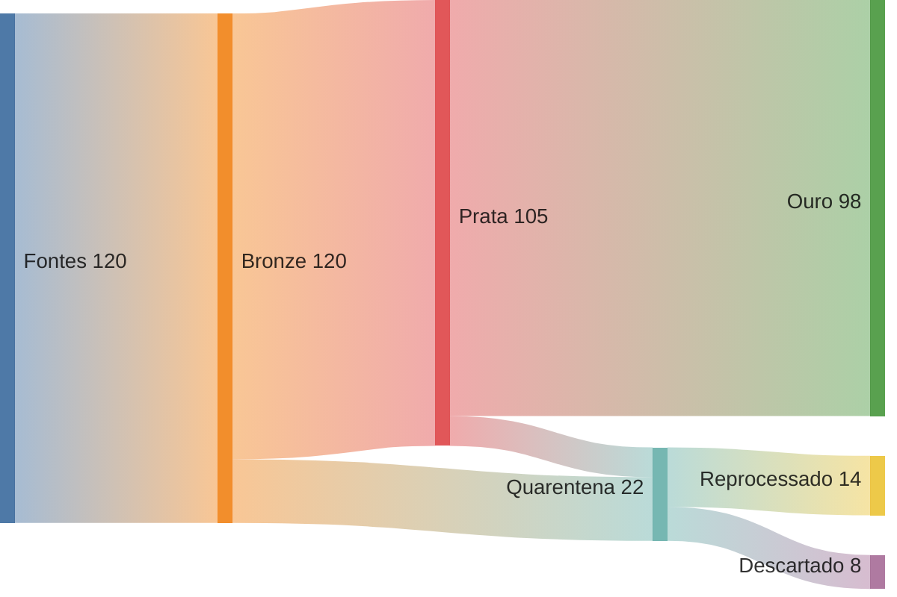
```mermaid
sankey-beta
    Fontes,Bronze,120
    Bronze,Prata,105
    Bronze,Quarentena,15
    Prata,Ouro,98
    Prata,Quarentena,7
    Quarentena,Reprocessado,14
    Quarentena,Descartado,8
```

## Gráfico XY

Barras e linhas na ordem da série (primária, azul, rosa, vermelho, menta, amarelo, lavanda, violeta); eixos e grade na cor de borda.

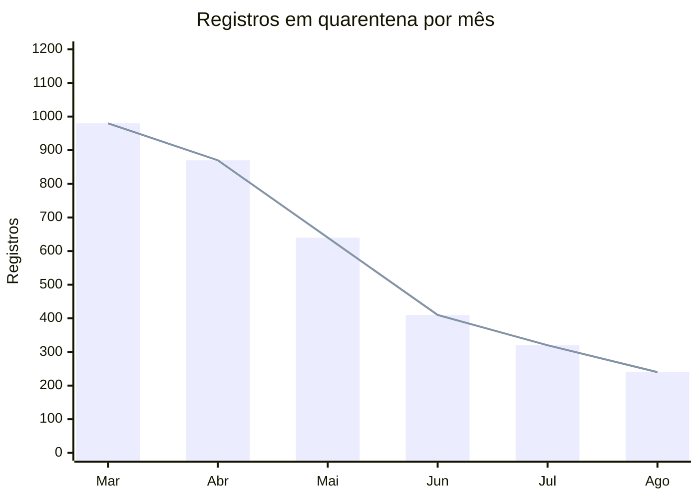
```mermaid
xychart-beta
    title "Registros em quarentena por mês"
    x-axis [Mar, Abr, Mai, Jun, Jul, Ago]
    y-axis "Registros" 0 --> 1200
    bar [980, 870, 640, 410, 320, 240]
    line [980, 870, 640, 410, 320, 240]
```

## Blocos

Blocos no card, agrupamentos no card interno, setas na cor primária.

```mermaid
block-beta
    columns 4
    Fontes:4
    space:4
    A["Bronze"] B["Prata"] C["Ouro"] D["BI"]
    A --> B
    B --> C
    C --> D
    space:4
    Q["Quarentena"]:2 R["Reprocessamento"]:2
    Q --> R
```

## Pacote

Herda só as variáveis base: blocos no card, borda e texto do tema, sem regra própria.

```mermaid
packet-beta
    0-15: "Cabeçalho"
    16-31: "Versão do schema"
    32-63: "Timestamp de ingestão"
    64-95: "Hash do registro"
    96-127: "Payload"
```

## Kanban

Colunas nos tons `tinted`, cartões no card com borda primária.

```mermaid
kanban
    backlog[Backlog]
        t1[Migrar conector do CRM]
        t2[Contrato da tabela de escolas]
    doing[Em andamento]
        t3[Quarentena para dados de teste]@{ assigned: "vinicius" }
    review[Revisão]
        t4[Gate de schema no CI]
    done[Concluído]
        t5[Camada Bronze do ERP]
        t6[Deploy com Asset Bundles]
```

## Arquitetura

Grupos com borda discreta, arestas de 2px na cor primária; os ícones vêm do próprio Mermaid.

```mermaid
architecture-beta
    group cloud(cloud)[Azure]
    service lake(disk)[Data Lake] in cloud
    service dbx(server)[Databricks] in cloud
    service uc(database)[Unity Catalog] in cloud
    service bi(internet)[Power BI]
    service erp(database)[ERP]
    erp:R --> L:lake
    lake:R --> L:dbx
    dbx:B --> T:uc
    dbx:R --> L:bi
```

## Radar

Uma curva por cor da série, com preenchimento translúcido; eixos na cor primária e grade na cor de borda.

```mermaid
radar-beta
    title Cobertura por camada
    axis ing["Ingestão"], val["Validação"], doc["Documentação"], tst["Testes"], mon["Monitoramento"]
    curve bronze["Bronze"]{90, 70, 40, 60, 50}
    curve ouro["Ouro"]{80, 95, 85, 90, 75}
    max 100
    min 0
```

## Como o tema é aplicado

O arquivo [`mermaid-config.js`](https://github.com/v-amorim/portfolio/blob/main/docs/javascripts/mermaid-config.js) guarda uma paleta por modo de cor e monta, a partir dela, as `themeVariables` e o `themeCSS` passados ao `mermaid.initialize`. Um observador no atributo de esquema do Material dispara a nova renderização quando o modo muda. A barra de ferramentas, o realce do código e o zoom em tela cheia ficam em [`mermaid-zoom.js`](https://github.com/v-amorim/portfolio/blob/main/docs/javascripts/mermaid-zoom.js). Para reutilizar em outro site MkDocs Material: copie os dois arquivos, ajuste as paletas e escreva os diagramas em blocos de código `mermaid`.
