# Every Mermaid diagram in the Moonlight theme

<small>September 4, 2026 · Tools, Documentation</small>

This page is a reference gallery: the 28 diagram types Mermaid 11 renders, some in more than one orientation or notation, all in this site's theme. The theme is [Moonlight](../projects.md#visual), the same palette as my VSCode and Oh My Posh themes, translated to Mermaid in a dark and a light variant. Switch the color scheme at the top of the page and every diagram re-renders on the spot.

Mermaid exposes hundreds of theme variables, yet several parts of the diagrams obey none of them: arrowheads, class relations, journey faces, timeline lines, the hardcoded Sankey and C4 colors. The theme works in two layers: the variables, generated from one palette per color scheme, and a stylesheet injected into the SVG for everything left over. Each section below says what to look at.

Every diagram has a toolbar above it: switch between diagram and source, copy the code, and expand to fullscreen with pan and zoom (mouse wheel or pinch to zoom, drag to move, double click or `0` to fit, `+` and `-` to zoom, `Esc` to close).

## Flow and process

Diagrams that carry something from one place to another.

### Small flowchart, left to right

The theme's base case: nodes on the card background, border and arrows in the primary color. Subroutines (`[[X]]`) get a yellow border, the palette's highlight color.

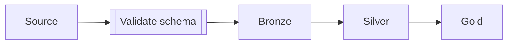

### Top-down flowchart with decisions

Diamonds and edge labels share the node background. Arrowheads get the primary color through CSS, because Mermaid's variable never reaches them.

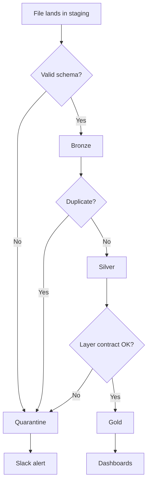

### Wide flowchart with subgraphs

Good for testing horizontal fit: on smaller screens it shrinks until unreadable, and zoom fixes that. Subgraphs use the inner card with a quiet border, grouping without competing with the nodes.

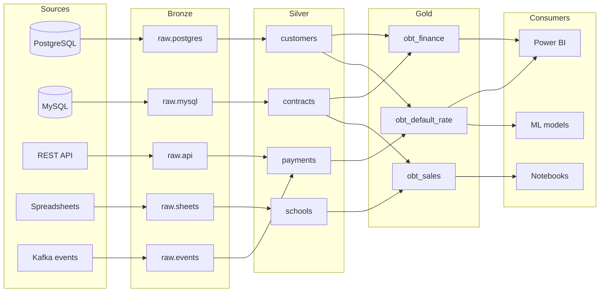

### Tall flowchart, bottom to top

Tests vertical scrolling and fitting when height is the limit.

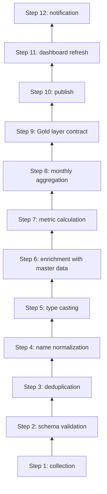

### Right-to-left flowchart

Same palette in any direction; only the layout changes.

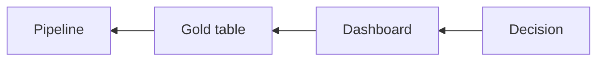

### State diagram

States on the card, transitions in the primary color, composite states on the inner card with an `accent` title bar.

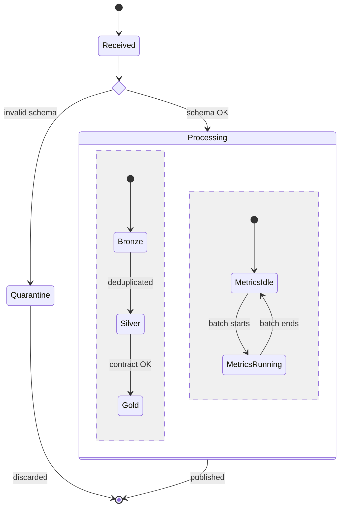

### User journey

Steps in the `mid` tones; faces in yellow, eyes and mouth in the background color.

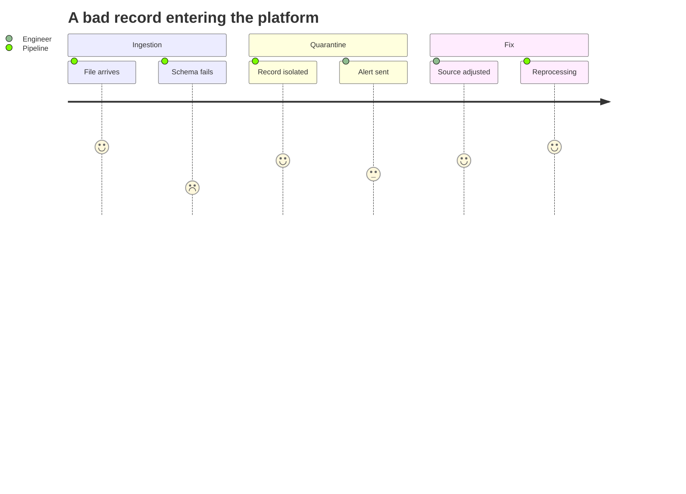

### Sankey

Flows in the `mid` tones: Mermaid paints with the Tableau palette, and the theme remaps each color through an attribute selector.

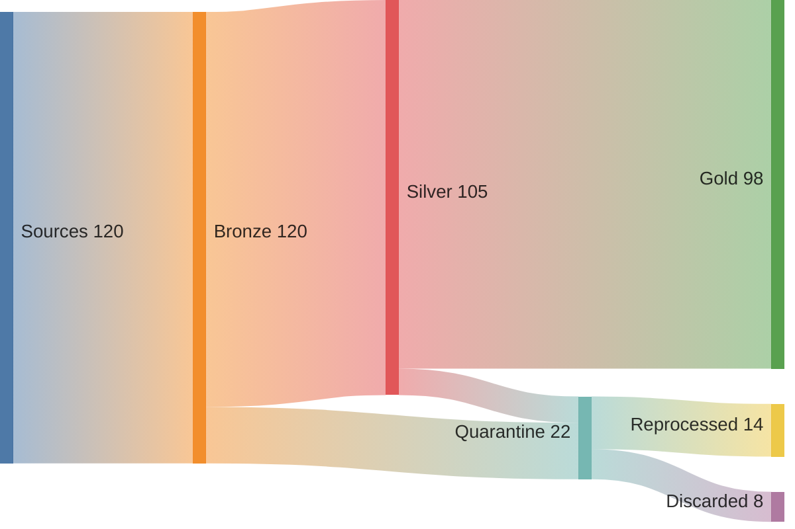

### Event modeling

Swimlanes on the inner card. The boxes walk the first three `tinted` tones, commands in primary, events in blue, read models in pink, with the UI boxes left on the plain card. Relations and arrowheads in the primary color.

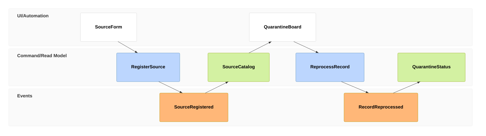

## Sequence and time

Diagrams whose horizontal axis is time, or order.

### Sequence diagram

Actors on the card, lifelines and messages in the primary color, notes in the `deep` tone; activations in the `accent` tone with a yellow border.

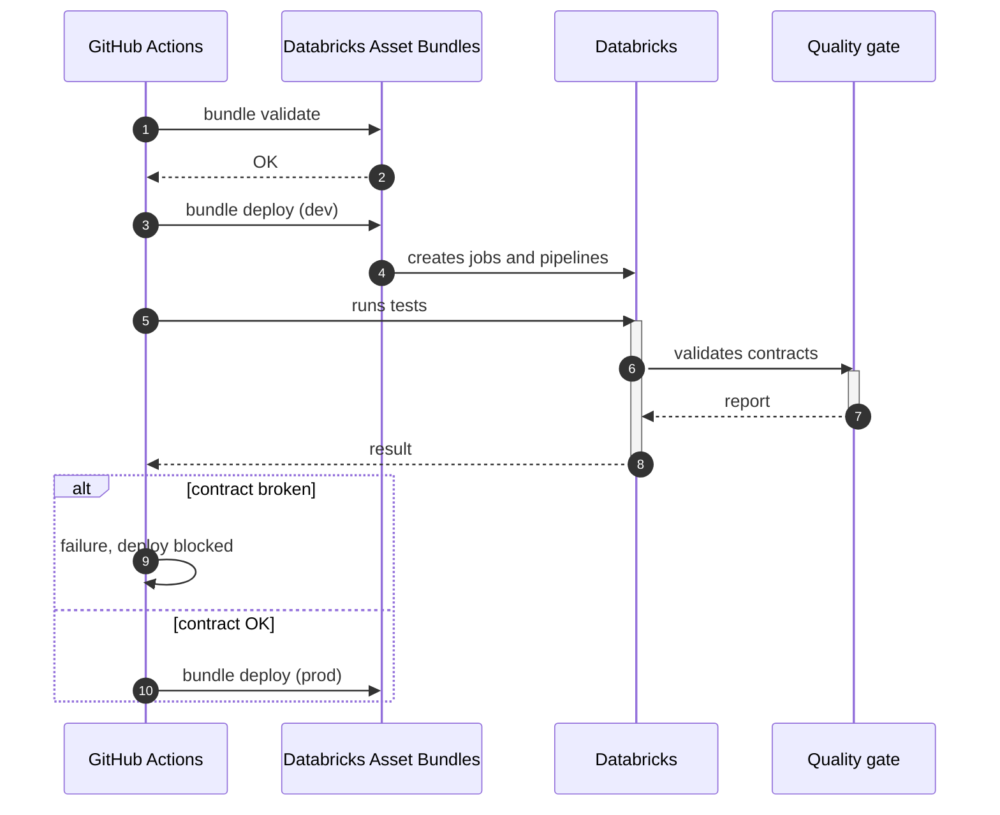

### Gantt

Tasks in the `deep` tone, active ones in the primary color, done ones in `accent`, critical ones in red. The today line is Moonlight yellow.

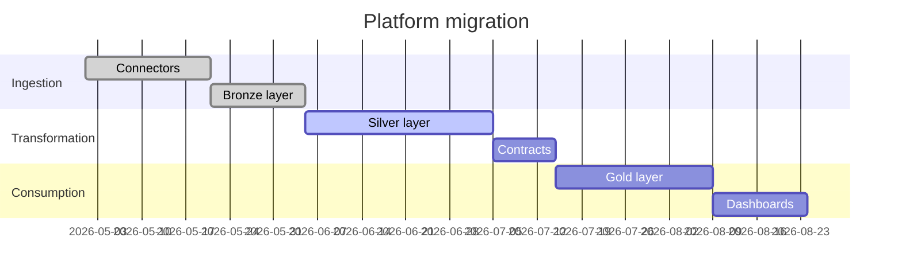

The same palette with milestones, a critical task and `excludes weekends`: the critical bar takes the palette red, the excluded days the inner card.

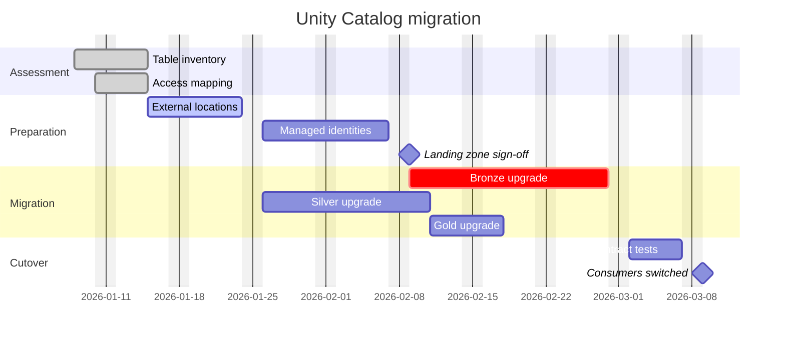

### Timeline

Events in the `tinted` tones. Line and markers forced to the primary color, since Mermaid draws them in black.

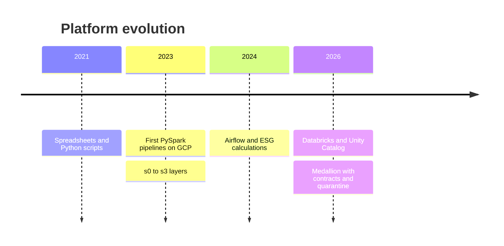

### Git graph

Branches in the `mid` tones, one step above the pie, with the theme's light text on them; tags in yellow, with dark text.

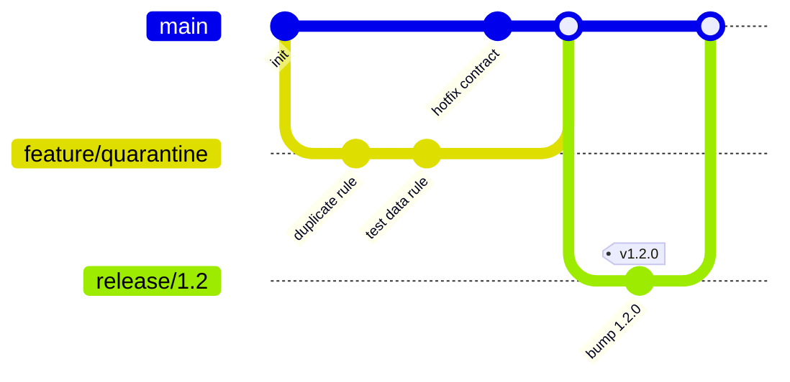

## Structure and models

Diagrams that describe how a thing is put together.

### Class diagram

Relations and arrows in the primary color, dashed for dependencies and realizations.

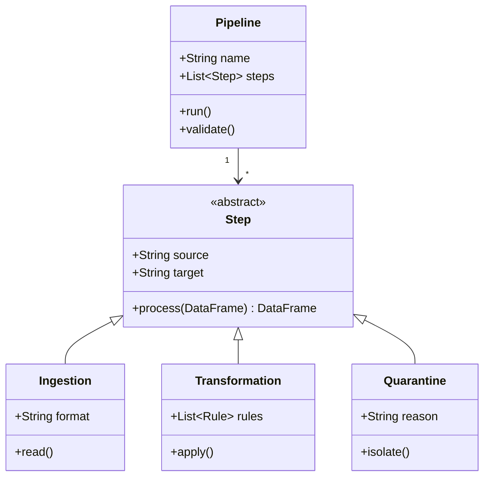

### Entity-relationship model

Attributes alternate card and inner card row by row; relationships in the primary color.

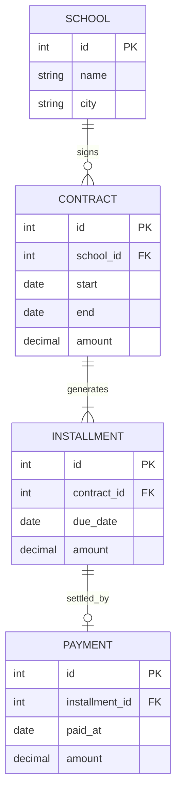

### C4 context

People in the primary color, systems in the `deep` tone, external ones in `accent`. Mermaid forces white text on C4 elements; the theme fixes it after rendering.

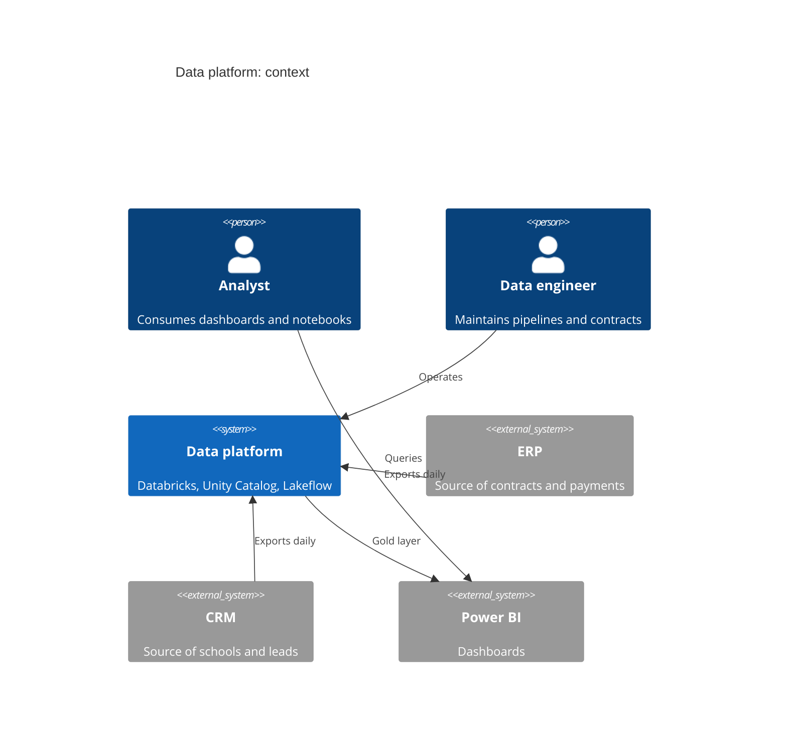

### Architecture

Groups with a quiet border, 2px edges in the primary color; the icons come from Mermaid itself.

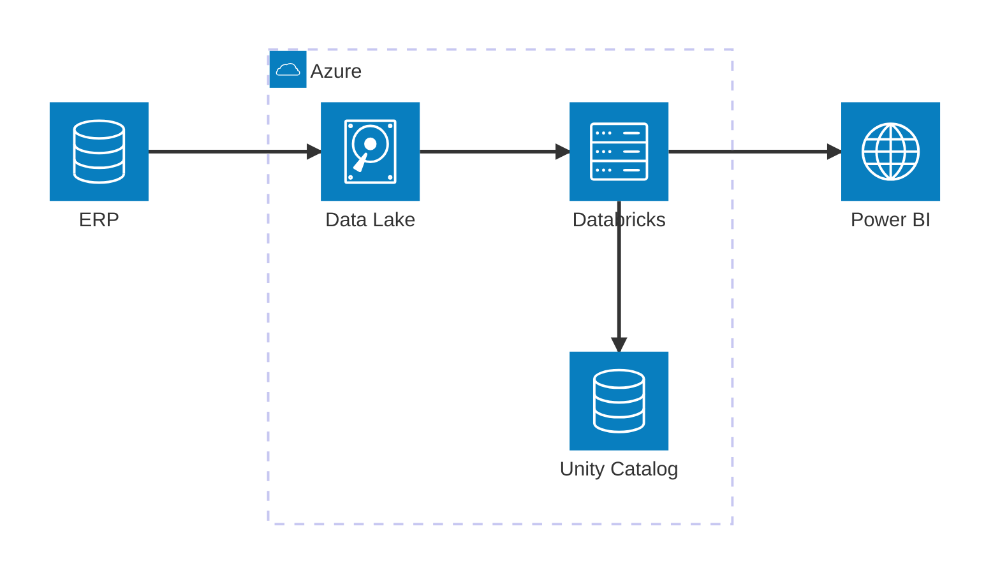

### Blocks

Blocks on the card, groups on the inner card, arrows in the primary color.

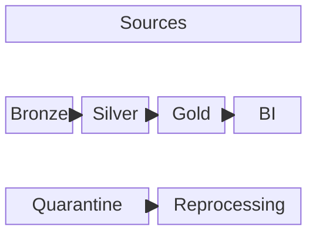

### Packet

Inherits only the base variables: blocks on the card, theme border and text, no rule of its own.

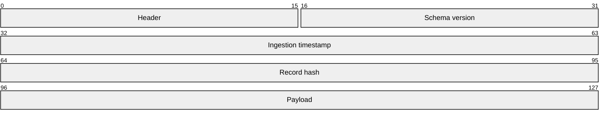

### Tree view

Directories in the primary color, files in the theme text, connector lines in the border color.

```mermaid
treeView-beta
data-platform/
    pipelines/
        bronze/
            erp_contracts.py
            crm_schools.py
        silver/
            payments.py
        gold/
            obt_default_rate.py
    tests/
        test_contracts.py
    databricks.yml
    pyproject.toml
    README.md
```

With `showIcons`, comments go in mint and the highlighted row sits on `accent` with a yellow border. Icons from an external pack need `registerIconPacks`, which this site does not call, so `logos:python` and `logos:postgresql` fall back to Mermaid's placeholder square; the built-in file and folder icons follow the muted tone.

```mermaid
---
config:
  treeView:
    showIcons: true
---
treeView-beta
pipelines/
    bronze.py :::highlight icon(logos:python) ## raw ingestion, no rules
    silver.py ## deduplication and contracts
    gold.sql icon(none)
sources/
    erp.conf icon(logos:postgresql)
.env ## workspace credentials
databricks.yml
pyproject.toml
```

```mermaid
---
config:
  treeView:
    showIcons: true
    defaultIconPack: material-icon-theme
    filenameIcons:
      Dockerfile: docker
    extensionIcons:
      .py: python
      .sql: database
      .txt: none
---
treeView-beta
data-platform/
    pipelines/
        bronze.py
        contracts.sql
    Dockerfile
    runbook.txt
    README.md
```

## Data and charts

Numbers rather than shapes: the series order carries the meaning here.

### XY chart

Bars and lines follow the series order (primary, blue, pink, red, mint, yellow, lavender, violet); axes and grid in the border color.

```mermaid
xychart-beta
    title "Quarantined records per month"
    x-axis [Mar, Apr, May, Jun, Jul, Aug]
    y-axis "Records" 0 --> 1200
    bar [980, 870, 640, 410, 320, 240]
    line [980, 870, 640, 410, 320, 240]
```

With `showDataLabel`, the value sits inside the bar in the page background color, which holds against every series tone.

```mermaid
---
config:
  xyChart:
    showDataLabel: true
---
xychart-beta
    title "Tables per layer"
    x-axis [Bronze, Silver, Gold, Quarantine, Sandbox]
    y-axis "Tables" 0 --> 120
    bar [112, 64, 28, 9, 41]
```

Two series and no config of their own: they take the first two entries of the series order.

```mermaid
xychart-beta
    title "Quarantined and reprocessed per quarter"
    x-axis [Q1, Q2, Q3, Q4]
    y-axis "Records" 0 --> 500
    line [420, 310, 190, 120]
    line [180, 240, 160, 110]
```

### Pie

Slices in the `tinted` tones: each hue of the series blended into the card background, so the chart does not shout.

```mermaid
pie showData
    title Records by destination last month
    "Gold" : 86
    "Quarantine: duplicates" : 8
    "Quarantine: invalid" : 4
    "Quarantine: test data" : 2
```

### Tree map

Sections take the `tinted` fills with the matching series color as their border, the same ramp as the pie; labels and values in the theme text.

```mermaid
---
config:
  treemap:
    valueFormat: '0,0'
---
treemap-beta
"Storage per layer, in GB"
    "Bronze"
        "ERP": 1400
        "CRM": 220
        "Kafka events": 60
    "Silver"
        "payments": 480
        "contracts": 180
    "Gold"
        "obt_finance": 320
        "obt_default_rate": 140
    "Quarantine"
        "duplicates": 30
        "invalid schema": 18
```

### Radar

One curve per series color with a translucent fill; axes in the primary color and graticule in the border color.

```mermaid
radar-beta
    title Coverage per layer
    axis ing["Ingestion"], val["Validation"], doc["Documentation"], tst["Tests"], mon["Monitoring"]
    curve bronze["Bronze"]{90, 70, 40, 60, 50}
    curve gold["Gold"]{80, 95, 85, 90, 75}
    max 100
    min 0
```

`graticule polygon` swaps the circular grid for a polygon, and a third curve picks up the next series color.

```mermaid
radar-beta
  title Environment readiness
  axis dep["Deploy"], obs["Observability"], acl["Access control"]
  axis cst["Cost control"], rec["Recovery"]

  curve dev["Dev"]{5, 2, 2, 3, 2}
  curve stg["Staging"]{4, 3, 4, 4, 3}
  curve prd["Prod"]{3, 5, 5, 4, 5}

  graticule polygon
  max 5
    min 0
```

With `curveOpacity: 0` the fills disappear and only the strokes are left, which is the readable option once curves start crossing.

```mermaid
---
config:
  radar:
    axisScaleFactor: 0.25
    curveTension: 0.1
  themeVariables:
    radar:
      curveOpacity: 0
---
radar-beta
  axis Bronze, Silver, Gold, Quarantine, Sandbox
  curve tables{1,2,3,4,5}
  curve jobs{5,4,3,2,1}
  curve owners{3,3,3,3,3}

```

### Quadrant chart

Quadrants alternate card and inner card; points in yellow so they jump off the background.

```mermaid
quadrantChart
    title Data source prioritization
    x-axis Low effort --> High effort
    y-axis Low value --> High value
    quadrant-1 Plan
    quadrant-2 Do now
    quadrant-3 Drop
    quadrant-4 Reassess
    CRM: [0.25, 0.85]
    ERP: [0.7, 0.9]
    Spreadsheets: [0.2, 0.3]
    App logs: [0.8, 0.35]
    Events: [0.55, 0.6]
```

### Venn

One circle per series color at low fill opacity, so the overlaps darken instead of muddying; labels in the theme text. This renderer writes its colors inline, so the theme has to override them rather than set them.

```mermaid
venn-beta
    title "What a table needs before it reaches Gold"
    set Docs
    set Tests
    set Contract
    union Docs,Tests["Queryable"]
    union Tests,Contract["Publishable"]
    union Docs,Contract["Handover"]
    union Docs,Tests,Contract["Gold"]
```

## Planning and analysis

Boards, breakdowns and maps for deciding what to do next.

### Kanban

Columns in the `tinted` tones, cards on the card background with a primary border.

```mermaid
kanban
    backlog[Backlog]
        t1[Migrate CRM connector]
        t2[Schools table contract]
    doing[In progress]
        t3[Quarantine for test data]@{ assigned: "vinicius" }
    review[Review]
        t4[Schema gate in CI]
    done[Done]
        t5[ERP Bronze layer]
        t6[Deploy with Asset Bundles]
```

Ticket links, assignees and priorities. The priority bar down the left of a card follows the palette: red for `Very High`, yellow for `High`, blue for `Low`.

```mermaid
---
config:
  kanban:
    ticketBaseUrl: 'https://github.com/v-amorim/portfolio/issues/#TICKET#'
---
kanban
  todo[Todo]
    docs[Document the Gold layer contracts]
    catalog[Publish the source catalog]@{ priority: 'Low' }
  inProgress[In progress]
    dedup[Handle late-arriving duplicates in Bronze]@{ assigned: 'vinicius', priority: 'High' }
  readyForTest[Ready for test]
    gate[Schema gate in CI]@{ ticket: 2038, assigned: 'vinicius', priority: 'High' }
  done[Done]
    bundles[Deploy with Asset Bundles]@{ assigned: 'vinicius' }
    longTitle[Quarantine keeps the rejected payload next to the rule that rejected it, so a reprocess needs no lookup in the source]@{ ticket: 2036, priority: 'Very High' }
    uc[Migrate the ERP schema to Unity Catalog]@{ ticket: 2037, assigned: 'vinicius', priority: 'High' }
```

### Mind map

Branches in the `tinted` tones, one per level; the root outlined in the primary color.

```mermaid
mindmap
  root((Data platform))
    Ingestion
      Batch
      Streaming
      APIs
    Quality
      Contracts
      Quarantine
        Duplicates
        Invalid
        Test data
      CI gates
    Consumption
      Dashboards
      Notebooks
      Models
```

### Ishikawa

Spine, branches and the head arrow in the primary color; cause boxes on the card with a primary border. It needs no rule of its own, the base variables reach every part of it.

```mermaid
ishikawa-beta
    Gold layer late for the morning dashboards
    Process
        Full reload instead of incremental
        Contract tests run after publish
    People
        A single on-call for the whole platform
        Source owner does not announce schema changes
    Equipment
        Cluster undersized for the monthly peak
        Storage throttled during the batch window
    Environment
        ERP export lands after 5 am
        Weekend backfill overlaps the daily run
    Measurement
        No alert when a task runs past its usual time
```

### Requirements

Requirements and elements on the card with a primary border; relations in the primary color, labels on the page background.

```mermaid
requirementDiagram
    requirement gold_contract {
        id: 1
        text: Every Gold table has a versioned schema
        risk: high
        verifymethod: test
    }
    functionalRequirement quarantine {
        id: 1.1
        text: An invalid record never reaches the Gold layer
        risk: high
        verifymethod: test
    }
    performanceRequirement latency {
        id: 2
        text: Daily pipeline finishes before 6 am
        risk: medium
        verifymethod: analysis
    }
    element ci_gate {
        type: GitHub Actions
    }
    element silver_pipeline {
        type: Lakeflow
    }
    ci_gate - verifies -> gold_contract
    silver_pipeline - satisfies -> quarantine
    quarantine - derives -> gold_contract
    silver_pipeline - satisfies -> latency
```

### Wardley map

The one renderer that emits no stylesheet of its own, so the injected CSS never reaches it and its leftovers are recolored from the site stylesheet instead. Components on the page background with primary borders, links and pipelines in the primary color, stage dividers in the border color, the deaccelerator in the palette red.

```mermaid
wardley-beta
title Data platform
size [1100, 800]

anchor Business decision [0.95, 0.62]

component Dashboard [0.86, 0.72] label [-30, -12]
component Gold layer [0.75, 0.58] label [-76, -12]
component Silver layer [0.65, 0.48] label [-72, -12]
component Bronze layer [0.55, 0.36] label [-74, -12]
component Ingestion [0.45, 0.26] label [-62, 20]
component Data contract [0.68, 0.30] label [-80, 18]
component Quarantine [0.58, 0.18] label [-70, 20]
component Notebook [0.84, 0.46] label [-64, 20]
component Orchestration [0.38, 0.54] label [-86, -12]
component Unity Catalog [0.48, 0.66] label [-30, -14]
component CI pipeline [0.30, 0.44] label [-70, 20]
component Compute [0.22, 0.74] label [-28, -14]
component Object storage [0.12, 0.86] label [-84, 18]
component Source system [0.40, 0.78] label [-40, 24]

Business decision -> Dashboard
Business decision -> Notebook
Dashboard -> Gold layer
Notebook -> Gold layer
Gold layer -> Silver layer
Silver layer -> Bronze layer
Bronze layer -> Ingestion
Ingestion -> Source system

Silver layer -> Data contract
Data contract -> Quarantine
Bronze layer -> Quarantine
Data contract -> CI pipeline

Gold layer -> Unity Catalog
Silver layer -> Unity Catalog
Ingestion -> Orchestration
Orchestration -> Compute
Compute -> Object storage

pipeline Bronze layer {
  component landing files [0.20]
  component managed tables [0.74]
}

pipeline Compute {
  component ad hoc cluster [0.30]
  component serverless [0.88]
}

deaccelerator Legacy CSV exports [0.34, 0.62]

annotations [1, 0]
annotation 1,[0.62, 0.24] "The contract is the gate into Gold"
annotation 2,[0.16, 0.80] "Commodity, rent it and move on"
annotation 3,[0.50, 0.20] "Keeps the payload and the rule that rejected it"

note "Consumers: analysts, notebooks, ML models" [0.06, 0.40]

```

## Grammar

Three notations, one renderer: syntax drawn as track. Nonterminals on the card, terminals in the `accent` tone, track and endpoints in the primary color.

### Railroad (IR)

```mermaid
railroad-beta
    title Gold table contract

    contract = sequence(nonterminal("table"), nonterminal("columns"), optional(nonterminal("partition"))) ;
    table = sequence(terminal("catalog"), terminal("."), terminal("schema"), terminal("."), terminal("name")) ;
    columns = sequence(nonterminal("column"), zeroOrMore(sequence(terminal(","), nonterminal("column")))) ;
    column = sequence(terminal("name"), nonterminal("type"), optional(terminal("not null"))) ;
    type = choice(terminal("string"), terminal("int"), terminal("decimal"), terminal("date"), terminal("timestamp")) ;
    partition = sequence(terminal("partitioned by"), terminal("column")) ;
```

### Railroad (ABNF)

```mermaid
railroad-abnf-beta
    title Fully qualified table name

    table = catalog "." schema "." name ;
    catalog = 1*( ALPHA / DIGIT / "_" ) ;
    schema = 1*( ALPHA / DIGIT / "_" ) ;
    name = 1*( ALPHA / DIGIT / "_" ) ;
```

### Railroad (PEG)

```mermaid
railroad-peg-beta
    title Quarantine reason code

    Reason <- Category "_" Detail ;
    Category <- "schema" / "duplicate" / "contract" ;
    Detail <- "missing" / "type" / "null" / "late" ;
```

## How the theme is applied

[`mermaid-config.js`](https://github.com/v-amorim/portfolio/blob/main/docs/javascripts/mermaid-config.js) holds one palette per color scheme and builds the `themeVariables` and `themeCSS` passed to `mermaid.initialize` from it. An observer on Material's scheme attribute triggers a re-render when the scheme changes. The toolbar, code highlighting and fullscreen zoom live in [`mermaid-zoom.js`](https://github.com/v-amorim/portfolio/blob/main/docs/javascripts/mermaid-zoom.js). The Wardley map is the exception: it gets no SVG stylesheet, so its rules live in `global.css` instead. To reuse it on another MkDocs Material site: copy both files, adjust the palettes and write the diagrams in `mermaid` code blocks.
