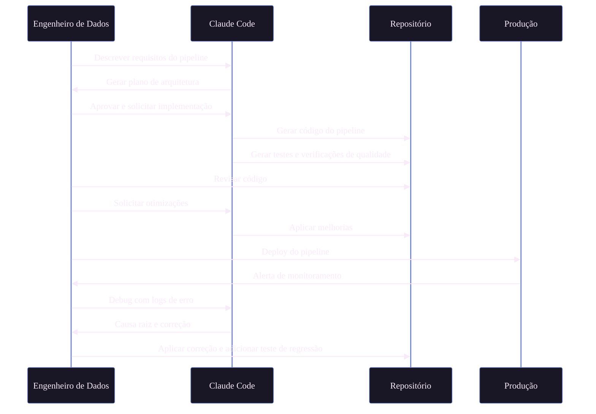

```mermaid
%%{init: {'theme':'base', 'themeVariables': { 'primaryColor':'#191726','primaryTextColor':'#f8eaf8','primaryBorderColor':'#7386d0','lineColor':'#7386d0','secondaryColor':'#282e46','secondaryTextColor':'#f8eaf8','secondaryBorderColor':'#5dabf3','tertiaryColor':'#3c466f','tertiaryTextColor':'#f8eaf8','tertiaryBorderColor':'#79c0ff','background':'transparent','mainBkg':'#191726','textColor':'#f8eaf8','fontSize':'14px','fontFamily':'Mulish, system-ui, sans-serif'}}}%%
graph LR
    A[Requisitos] --> B[Claude Code]
    B --> C[Gerar Código]
    C --> D[Revisar e Testar]
    D --> E{Aprovado?}
    E -->|Não| F[Iterar com Claude]
    F --> B
    E -->|Sim| G[Deploy]
    G --> H[Monitorar]
    H --> I{Problemas?}
    I -->|Sim| J[Debug com Claude]
    J --> B
    I -->|Não| K[Produção]

    style B fill:#282e46,stroke:#7386d0,stroke-width:3px
    style K fill:#3c466f,stroke:#5dabf3,stroke-width:2px
```

# Claude Code para Engenharia de Dados

Como engenheiro de dados, estou constantemente trabalhando com pipelines complexos, transformações e infraestrutura. Claude Code se tornou uma ferramenta essencial no meu fluxo de trabalho, me ajudando a construir sistemas de dados mais robustos e rápidos. Veja como uso para enfrentar desafios comuns de engenharia de dados.

<!-- more -->

## Por que Claude Code para Engenharia de Dados?

Engenharia de dados envolve lidar com múltiplas tecnologias, desde SQL e Python até ferramentas de orquestração como Airflow e infraestrutura como código. Claude Code se destaca em entender contexto através de diferentes arquivos e tecnologias, tornando-o perfeito para a natureza poliglota do trabalho com dados.

### Principais Benefícios

| Benefício                     | Descrição                                                    | Impacto                                           |
| ----------------------------- | ------------------------------------------------------------ | ------------------------------------------------- |
| **Contexto multi-arquivo**    | Entende relacionamentos entre DAGs, transformações e schemas | Mantém consistência entre componentes de pipeline |
| **Versatilidade tecnológica** | Lida com SQL, Python, YAML, Terraform de forma integrada     | Reduz sobrecarga de mudança de contexto           |
| **Reconhecimento de padrões** | Aprende com as convenções da sua base de código              | Reforça padrões consistentes de codificação       |
| **Suporte a testes**          | Gera testes unitários e verificações de qualidade de dados   | Melhora a confiabilidade do pipeline              |
| **Documentação**              | Cria documentação inline e markdown                          | Reduz silos de conhecimento                       |

## Casos de Uso do Mundo Real

### Fluxo de Trabalho de Engenharia de Dados com Claude Code

### 1. Construindo Pipelines ETL

Claude Code ajuda a estruturar pipelines ETL completos entendendo seus modelos de dados e requisitos de transformação. Descrevo quais dados preciso extrair e como devem ser transformados, e ele gera:

- Conectores de origem com tratamento adequado de erros
- Lógica de transformação com validação de dados
- Padrões de carregamento idempotentes
- Logging abrangente

**Exemplo de prompt**: _"Crie um pipeline ETL que extraia eventos de usuário do PostgreSQL, agregue métricas diárias e carregue no BigQuery com deduplicação"_

### 2. Otimização de Queries SQL

Ao lidar com queries lentas, compartilho o SQL e schemas das tabelas. Claude Code analisa planos de query e sugere:

- Recomendações de índices
- Reescrita de queries para melhor desempenho
- Estratégias de particionamento
- Anti-padrões comuns a evitar

### 3. Verificações de Qualidade de Dados

Qualidade de dados é crítica. Uso Claude Code para gerar:

- Suites do Great Expectations baseadas em profiling de dados
- Funções de validação customizadas para regras de negócio
- Lógica de detecção de anomalias
- Scripts de reconciliação entre origem e destino

### 4. Desenvolvimento de DAGs Airflow

Criar DAGs Airflow envolve muito boilerplate. Claude Code acelera isso:

- Gerando estrutura de DAG com dependências adequadas
- Criando grupos de tarefas e mapeamento dinâmico de tarefas
- Adicionando lógica de retry e alertas
- Escrevendo documentação inline

### 5. Evolução de Schema

Quando schemas mudam, Claude Code ajuda a gerenciar migrações:

- Gera statements ALTER TABLE
- Atualiza lógica de transformação para lidar com novos campos
- Modifica dependências downstream
- Cria mudanças retrocompatíveis

## Melhores Práticas

### Forneça Contexto

Sempre compartilhe arquivos de contexto relevantes:

- Schemas de tabelas (DDL ou documentação)
- Código de pipeline existente para correspondência de padrões
- Arquivos de configuração (Airflow, dbt, etc.)
- Requisitos de qualidade de dados

### Use CLAUDE.md

Mantenho um `CLAUDE.md` nos meus projetos de dados com:

- Convenções de nomenclatura (tabelas, colunas, DAGs)
- Bibliotecas e padrões preferidos
- Padrões de qualidade de dados
- Procedimentos de deploy

### Itere em Lógica Complexa

Para transformações complexas:

1. Comece com lógica de alto nível
2. Revise e refine
3. Adicione casos extremos
4. Gere testes
5. Otimize desempenho

### Aproveite a Memória

Claude Code lembra o contexto do projeto entre sessões. Uso isso para:

- Construir sobre conversas anteriores
- Manter consistência nas convenções
- Evitar reexplicar a arquitetura

## Fluxos de Trabalho Comuns

### Ciclo de Vida do Desenvolvimento de Pipeline

### Comparação de Fluxos de Trabalho

| Fluxo de Trabalho | Etapas                                         | Papel do Claude Code                                              | Tempo Economizado |
| ----------------- | ---------------------------------------------- | ----------------------------------------------------------------- | ----------------- |
| **Novo Pipeline** | Requisitos → Design → Código → Teste → Deploy  | Planejamento de arquitetura, geração de código, criação de testes | ~60%              |
| **Debugging**     | Alerta → Logs → Análise → Correção → Teste     | Análise de logs, identificação de causa raiz, geração de correção | ~40%              |
| **Refatoração**   | Identificar → Planejar → Implementar → Validar | Análise de impacto, mudanças incrementais, atualização de testes  | ~50%              |
| **Otimização**    | Profiling → Analisar → Melhorar → Benchmark    | Reescrita de queries, sugestões de índices, otimização de código  | ~45%              |

## Integração com Ferramentas

### Capacidades Específicas por Ferramenta

| Ferramenta             | O que Claude Code Faz                                            | Exemplo de Caso de Uso                             |
| ---------------------- | ---------------------------------------------------------------- | -------------------------------------------------- |
| **dbt**                | Gera modelos com materializações, testes, docs, macros           | Criar tabelas dimensão com lógica SCD Tipo 2       |
| **Apache Spark**       | Escreve PySpark otimizado, lida com particionamento, gera testes | Processar datasets de 100GB+ com shuffle otimizado |
| **Airflow**            | Cria DAGs com dependências, lógica de retry, alertas             | Construir pipelines complexos multi-etapas         |
| **Terraform**          | Define recursos cloud, IAM, configs de monitoramento             | Provisionar datasets BigQuery com acesso adequado  |
| **Great Expectations** | Gera suites de expectations a partir de profiling de dados       | Validar qualidade de dados em datasets de entrada  |
| **SQL**                | Otimiza queries, sugere índices, reescreve lógica                | Acelerar queries analíticas lentas                 |

## Dicas para Máxima Produtividade

### Checklist de Melhores Práticas

| Prática                             | Por que Importa                 | Exemplo                                                            |
| ----------------------------------- | ------------------------------- | ------------------------------------------------------------------ |
| **Seja específico**                 | Reduz ciclos de iteração        | "Processar 10M linhas/dia com <5min latência" vs "pipeline rápido" |
| **Compartilhe erros completamente** | Possibilita diagnóstico preciso | Stack trace completo + contexto de código relevante                |
| **Descreva dados**                  | Informa decisões de otimização  | "Alta cardinalidade user_id, enviesado por país"                   |
| **Revise SQL cuidadosamente**       | Previne erros custosos          | Verificar condições de join, lógica de agregação                   |
| **Documente conforme avança**       | Mantém conhecimento             | Gerar README, comentários inline                                   |
| **Teste incrementalmente**          | Detecta problemas cedo          | Validar cada etapa de transformação                                |

### Engenharia de Prompt para Tarefas de Dados

```mermaid
%%{init: {'theme':'base', 'themeVariables': { 'primaryColor':'#191726','primaryTextColor':'#f8eaf8','primaryBorderColor':'#7386d0','lineColor':'#7386d0','secondaryColor':'#282e46','secondaryTextColor':'#f8eaf8','secondaryBorderColor':'#5dabf3','tertiaryColor':'#3c466f','tertiaryTextColor':'#f8eaf8','tertiaryBorderColor':'#79c0ff','background':'transparent','mainBkg':'#191726','textColor':'#f8eaf8','fontSize':'14px','fontFamily':'Mulish, system-ui, sans-serif'}}}%%
graph TD
    A[Prompt Vago] --> B{Específico?}
    B -->|Não| C[Adicionar Contexto]
    C --> D[Volume de Dados]
    C --> E[SLAs]
    C --> F[Restrições]
    D --> B
    E --> B
    F --> B
    B -->|Sim| G[Claude Gera]
    G --> H[Revisar]
    H --> I{Bom?}
    I -->|Não| J[Refinar Prompt]
    J --> B
    I -->|Sim| K[Sucesso]

    style A fill:#ca5f71,stroke:#ca5f71,stroke-width:2px
    style K fill:#3c466f,stroke:#5dabf3,stroke-width:2px
    style G fill:#282e46,stroke:#7386d0,stroke-width:3px
```

## Limitações a Considerar

### Checklist de Segurança

| Área             | Risco                         | Mitigação                                |
| ---------------- | ----------------------------- | ---------------------------------------- |
| **Lógica SQL**   | Joins/agregações incorretas   | Testar com amostras de dados reais       |
| **Segurança**    | IAM excessivamente permissivo | Revisar todas as concessões de permissão |
| **Desempenho**   | Ineficiente em escala         | Benchmark com volumes de produção        |
| **Idempotência** | Dados duplicados              | Verificar comportamento em reexecução    |
| **Compliance**   | Exposição de PII              | Auditar práticas de manipulação de dados |

## Conclusão

Claude Code transformou como abordo tarefas de engenharia de dados. Não substitui a necessidade de conhecimento técnico profundo, mas amplifica a produtividade ao lidar com boilerplate, sugerir otimizações e manter consistência em grandes bases de código.

A chave é tratá-lo como um programador em par experiente que entende seu contexto e convenções. Com orientação adequada e iteração, torna-se uma ferramenta inestimável para construir plataformas de dados confiáveis e manuteníveis.

---

_Você já usou Claude Code para engenharia de dados? Adoraria ouvir sobre suas experiências e casos de uso. Sinta-se à vontade para entrar em contato ou deixar comentários!_
