# Claude Code para engenharia de dados

Trabalho o dia todo com pipelines, transformações e infraestrutura, e o Claude Code virou parte fixa desse fluxo. Não escreve o pipeline por mim, mas tira da frente o boilerplate e me deixa focar nas decisões que importam. Veja como uso no dia a dia.

<!-- more -->

## Por que funciona para dados

Engenharia de dados é poliglota: SQL, Python, YAML, Terraform, Airflow, tudo no mesmo projeto. O ponto forte do Claude Code é entender o contexto entre esses arquivos, então ele mantém a consistência entre um DAG, a transformação que ele dispara e o schema da tabela de destino, em vez de tratar cada arquivo isoladamente.

## Na prática

```mermaid
%%{init: {'theme':'base', 'themeVariables': { 'primaryColor':'#191726','primaryTextColor':'#f8eaf8','primaryBorderColor':'#7386d0','lineColor':'#7386d0','secondaryColor':'#282e46','secondaryTextColor':'#f8eaf8','secondaryBorderColor':'#5dabf3','tertiaryColor':'#3c466f','tertiaryTextColor':'#f8eaf8','tertiaryBorderColor':'#79c0ff','background':'transparent','mainBkg':'#191726','textColor':'#f8eaf8','fontSize':'14px','fontFamily':'Mulish, system-ui, sans-serif'}}}%%
graph LR
    A[Requisitos] --> B[Claude Code]
    B --> C[Gerar Código]
    C --> D[Revisar e Testar]
    D --> E{Aprovado?}
    E -->|Não| F[Iterar com Claude]
    F --> B
    E -->|Sim| G[Deploy]
    G --> H[Monitorar]
    H --> I{Problemas?}
    I -->|Sim| J[Debug com Claude]
    J --> B
    I -->|Não| K[Produção]

    style B fill:#282e46,stroke:#7386d0,stroke-width:3px
    style K fill:#3c466f,stroke:#5dabf3,stroke-width:2px
```

Os usos que mais me economizam tempo:

- **Pipelines ETL**: descrevo origem, transformação e destino, e ele monta os conectores com tratamento de erro, validação e carga idempotente.
- **Queries SQL lentas**: compartilho o SQL e os schemas, e ele aponta índices, reescritas e estratégias de particionamento.
- **Qualidade de dados**: gera suites do Great Expectations a partir do profiling e funções de validação para regras de negócio.
- **DAGs do Airflow**: cria a estrutura com dependências, retry e alertas, cortando o boilerplate.
- **Evolução de schema**: escreve os `ALTER TABLE` e ajusta as dependências downstream de forma retrocompatível.

## Como tiro mais proveito

O que faz diferença não é o prompt perfeito, é o contexto. Na prática:

- **Dou contexto antes de pedir**: schemas, código existente para ele imitar o padrão e os arquivos de config do projeto.
- **Mantenho um `CLAUDE.md`** com convenções de nomenclatura, bibliotecas preferidas e procedimentos de deploy. Ele lê e segue.
- **Sou específico**: "processar 10M linhas/dia com menos de 5min de latência" rende muito mais que "pipeline rápido".
- **Itero em etapas**: lógica de alto nível primeiro, depois casos extremos, depois testes.

## Onde tomar cuidado

Ele acelera, mas não dispensa revisão. Os pontos que sempre confiro:

| Área             | Risco                         | Como mitigo                              |
| ---------------- | ----------------------------- | ---------------------------------------- |
| **Lógica SQL**   | Joins/agregações incorretas   | Testo com amostras de dados reais        |
| **Segurança**    | IAM permissivo demais         | Reviso cada concessão de permissão       |
| **Desempenho**   | Ineficiente em escala         | Faço benchmark com volumes de produção   |
| **Idempotência** | Dados duplicados              | Verifico o comportamento em reexecução   |
| **Compliance**   | Exposição de PII              | Audito o manuseio dos dados              |

## Conclusão

O Claude Code não substitui conhecimento técnico, ele amplifica produtividade ao cuidar do boilerplate e manter consistência num projeto grande. A melhor forma de pensar nele é como um par experiente: com contexto e iteração, vira ferramenta indispensável para construir plataformas de dados confiáveis.

---

_Você já usou o Claude Code para engenharia de dados? Me conta como foi pelo [LinkedIn](https://www.linkedin.com/in/vinicius-amorim/)._
